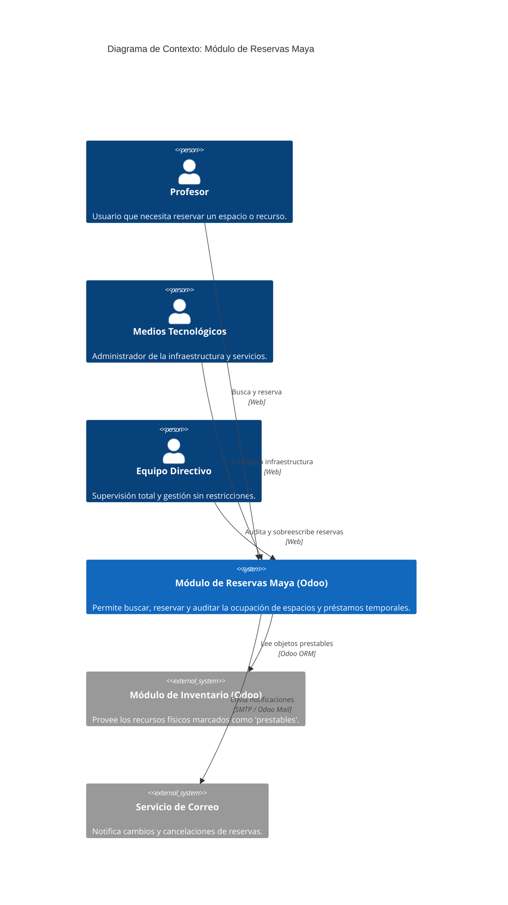
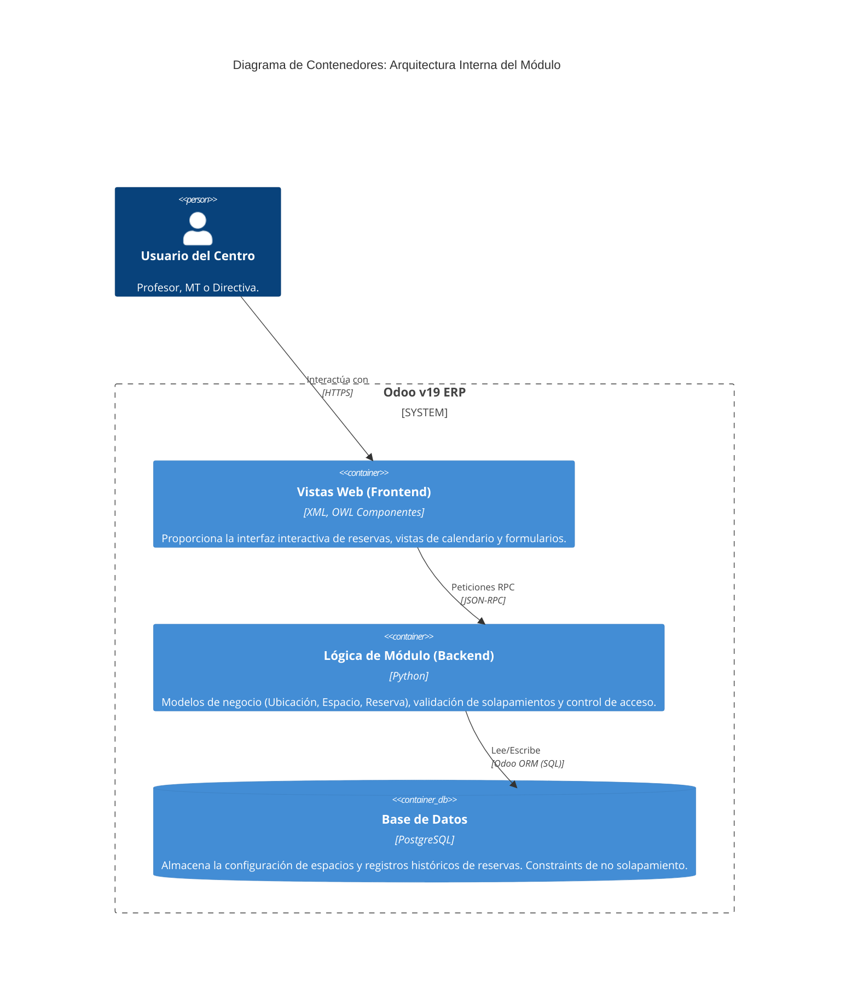
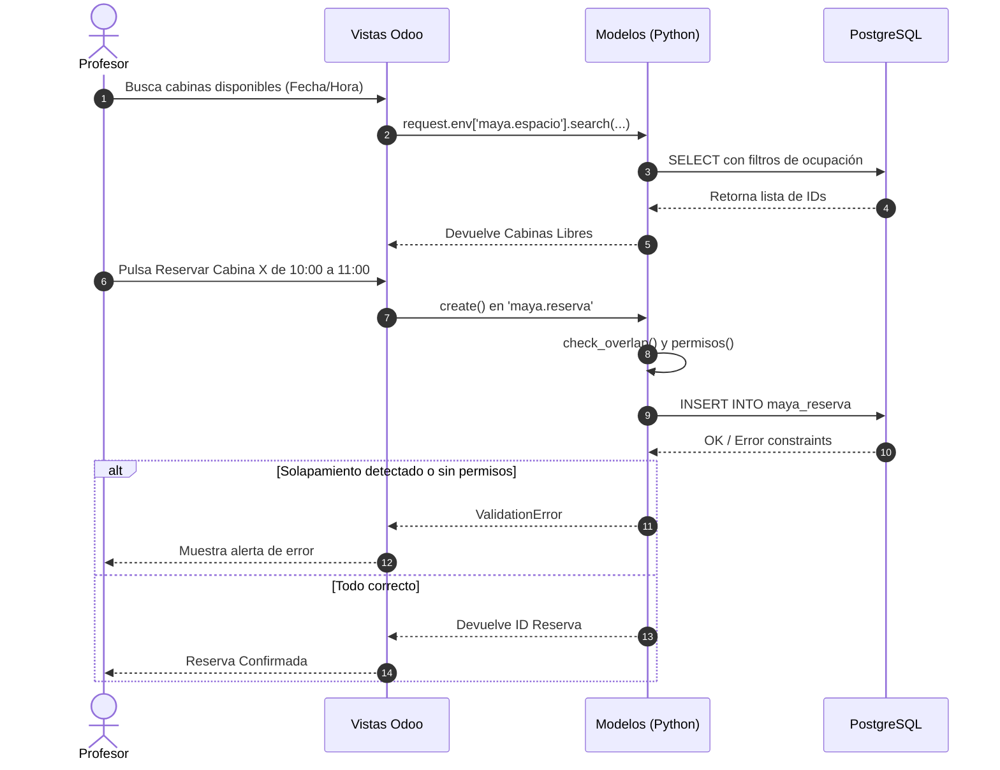

# Diagramas de Arquitectura (C4 Model)

## 1. Diagrama de Contexto (Nivel 1)

```mermaid
C4Context
    title Diagrama de Contexto: Módulo de Reservas Maya

    Person(profesor, "Profesor", "Usuario que necesita reservar un espacio o recurso.")
    Person(mt, "Medios Tecnológicos", "Administrador de la infraestructura y servicios.")
    Person(directiva, "Equipo Directivo", "Supervisión total y gestión sin restricciones.")

    System(maya, "Módulo de Reservas Maya (Odoo)", "Permite buscar, reservar y auditar la ocupación de espacios y préstamos temporales.")
    
    System_Ext(inventario, "Módulo de Inventario (Odoo)", "Provee los recursos físicos marcados como 'prestables'.")
    System_Ext(mail, "Servicio de Correo", "Notifica cambios y cancelaciones de reservas.")

    Rel(profesor, maya, "Busca y reserva", "Web")
    Rel(mt, maya, "Configura infraestructura", "Web")
    Rel(directiva, maya, "Audita y sobreescribe reservas", "Web")
    
    Rel(maya, inventario, "Lee objetos prestables", "Odoo ORM")
    Rel(maya, mail, "Envía notificaciones", "SMTP / Odoo Mail")
```

## 2. Diagrama de Contenedores (Nivel 2)

```mermaid
C4Container
    title Diagrama de Contenedores: Arquitectura Interna del Módulo

    Person(user, "Usuario del Centro", "Profesor, MT o Directiva.")

    System_Boundary(odoo_v19, "Odoo v19 ERP") {
        Container(webapp, "Vistas Web (Frontend)", "XML, OWL Componentes", "Proporciona la interfaz interactiva de reservas, vistas de calendario y formularios.")
        Container(backend, "Lógica de Módulo (Backend)", "Python", "Modelos de negocio (Ubicación, Espacio, Reserva), validación de solapamientos y control de acceso.")
        ContainerDb(db, "Base de Datos", "PostgreSQL", "Almacena la configuración de espacios y registros históricos de reservas. Constraints de no solapamiento.")
    }

    Rel(user, webapp, "Interactúa con", "HTTPS")
    Rel(webapp, backend, "Peticiones RPC", "JSON-RPC")
    Rel(backend, db, "Lee/Escribe", "Odoo ORM (SQL)")
```

## 3. Flujo Crítico de Reserva

```mermaid
sequenceDiagram
    autonumber
    actor User as Profesor
    participant UI as Vistas Odoo
    participant ORM as Modelos (Python)
    participant DB as PostgreSQL

    User->>UI: Busca cabinas disponibles (Fecha/Hora)
    UI->>ORM: request.env['maya.espacio'].search(...)
    ORM->>DB: SELECT con filtros de ocupación
    DB-->>ORM: Retorna lista de IDs
    ORM-->>UI: Devuelve Cabinas Libres
    User->>UI: Pulsa Reservar Cabina X de 10:00 a 11:00
    UI->>ORM: create() en 'maya.reserva'
    ORM->>ORM: check_overlap() y permisos()
    ORM->>DB: INSERT INTO maya_reserva
    DB-->>ORM: OK / Error constraints
    alt Solapamiento detectado o sin permisos
        ORM-->>UI: ValidationError
        UI-->>User: Muestra alerta de error
    else Todo correcto
        ORM-->>UI: Devuelve ID Reserva
        UI-->>User: Reserva Confirmada
    end
```
